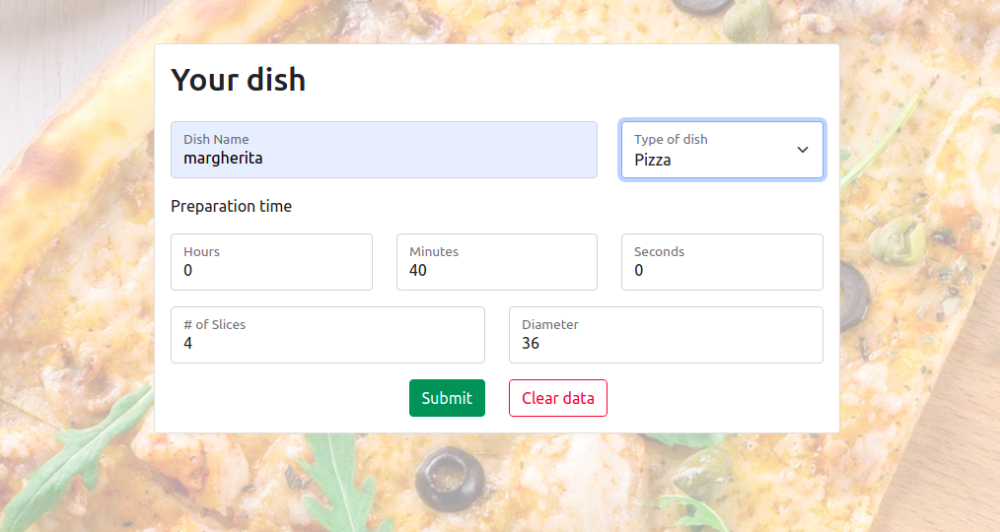

# HexOcean Form

[Live demo](https://warm-temple-51075.herokuapp.com/).

This project was bootstrapped with [Create React App](https://github.com/facebook/create-react-app).

### `npm install`

To install all nessessary modules run `npm install`.

### `npm start`

Runs the app in the development mode.\
Open [http://localhost:3000](http://localhost:3000) to view it in the browser.

Application is build on React Hooks with Redux-Form used. Task is made in accordance with the requirements. HTTP posts are made with AxiosJS. All fields except `name` and `type` and validated on client-side (form can't be submitted until filling them), `name` and `type` fields can be submitted unfilled (error response data returned from server will be displayed in this case). Styled with Bootstrap.